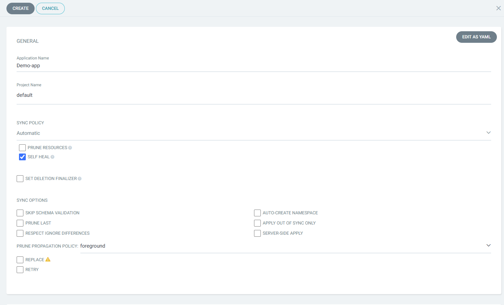
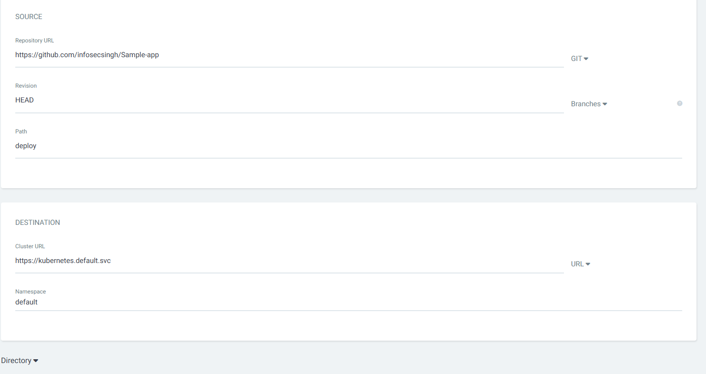
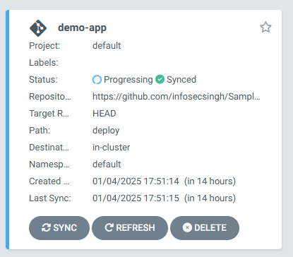
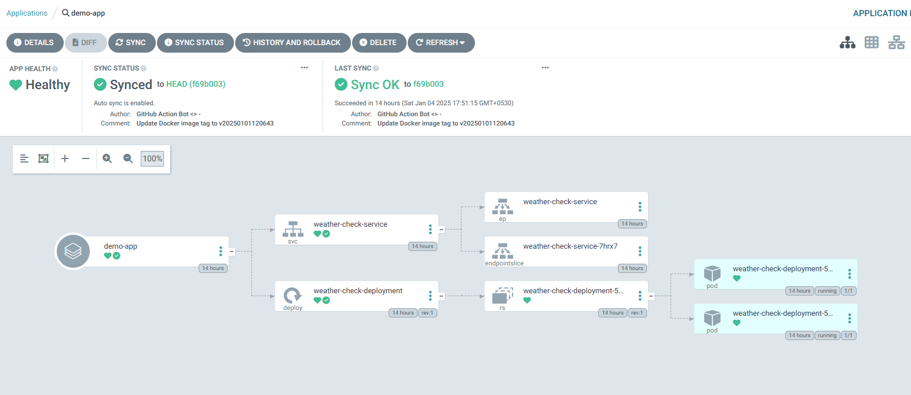
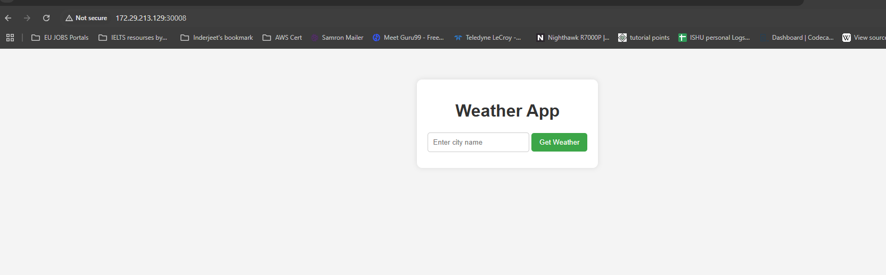

### Deploy Python Flask App on Kubernetes cluster with GitOps Approach. 

## Test Application Locally. 
Whenever we are creating pipeline, it is best practice to test application locally.
- Application prequisities. 
  - Python 3.9 
  - pip installed

- Clone/Fork the Repo. 
    ```
    git clone https://github.com/infosecsingh/Flask-App-GitHub-Actions-ArgoCD.git
    cd Flask-App-GitHub-Actions-ArgoCD
    ```
- Install Dependence
    ```
    pip install -r requirements.txt
    ```
- Run locally. 
    ```
    python app.py
    ```
- Access the application.
    ```
    http://localhost:5000
    ```
---
## Containerize Application.

#### Build and Run the Container
1. Build the Image
2. Create container with image.
 
## CI Pipeline with GitHub Actions
1. Create a directory inside your project.
    ```
    mkdir -p .github/Workflows
    ```
2. Create your first pipeline for TEST and BUILD the image

3. Setup your docker Personal Access token into github repo. 

## Setup ArgoCD in Minikube

Note: You can setup Argo CD in any cluster, instructions are same. 

- First install Minikube:
    Installation guide for installing Minikube. 
    [Minikube.sigs.k8s.io](https://minikube.sigs.k8s.io/docs/start/?arch=%2Fwindows%2Fx86-64%2Fstable%2F.exe+download)

---
- Install Argo CD
    ```
    kubectl create namespace argocd
    kubectl apply -n argocd -f https://raw.githubusercontent.com/argoproj/argo-cd/stable/manifests/install.yaml 
    ```

- Verify if ArgoCD is running:
    ```
    kubectl get all -n argocd
    ```
---
- Access ArgoCD With configuring NodePort 
    ```
    kubectl patch svc argocd-server -n argocd -p '{"spec": {"type": "NodePort"}}'
    ```
- Verify if ArgoCD server running as NodePort.
   ```
   kubectl get svc -n argocd
   ``` 
- Grab ArgoCD secret for accessing UI
   ```
   kubectl get secrets -n argocd argocd-initial-admin-secret -o jsonpath='{.data.password}' | base64 -d
   ```
- Start Minkube Service. 
   ```
    minikube service argocd-server -n argocd
    ```
---
Setup our Continous deployment. 

- Select New App.


---
- Syncing your manifests files:

---

- Successfully Deployed our app:

---
Access Application with below command.
```
minikube service list
```
Output
```
|-------------|-----------------------------------------|--------------|-----------------------------|
|  NAMESPACE  |                  NAME                   | TARGET PORT  |             URL             |
|-------------|-----------------------------------------|--------------|-----------------------------|
| argocd      | argocd-applicationset-controller        | No node port |                             |
| argocd      | argocd-dex-server                       | No node port |                             |
| argocd      | argocd-metrics                          | No node port |                             |
| argocd      | argocd-notifications-controller-metrics | No node port |                             |
| argocd      | argocd-redis                            | No node port |                             |
| argocd      | argocd-repo-server                      | No node port |                             |
| argocd      | argocd-server                           | http/80      | http://172.29.213.129:30692 |
|             |                                         | https/443    | http://172.29.213.129:31365 |
| argocd      | argocd-server-metrics                   | No node port |                             |
| default     | kubernetes                              | No node port |                             |
| default     | weather-check-service                   |         5000 | http://172.29.213.129:30008 |
| kube-system | kube-dns                                | No node port |                             |
|-------------|-----------------------------------------|--------------|-----------------------------|
```
---
Application running on http://172.29.213.129:30008


